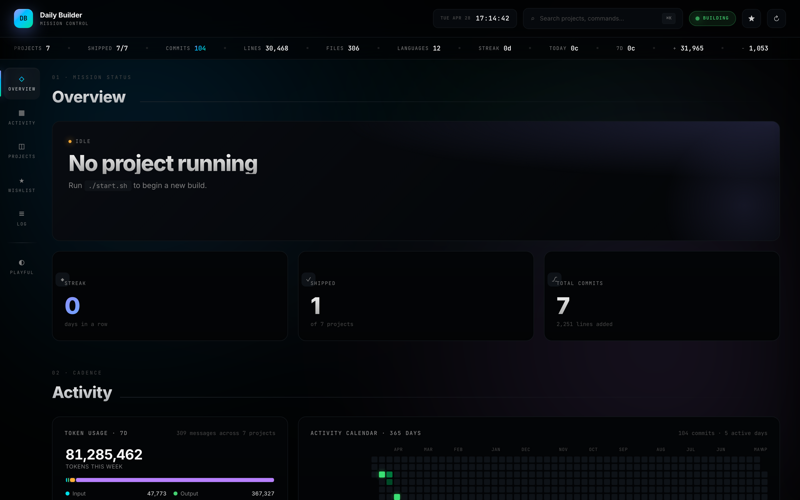
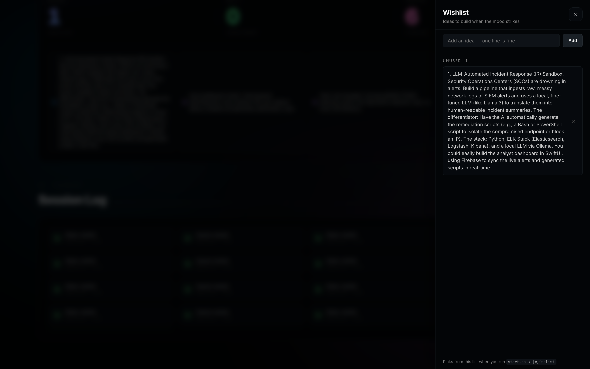
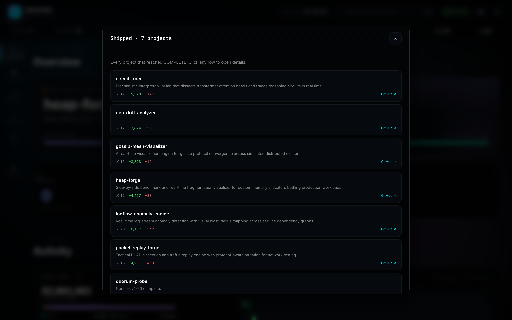
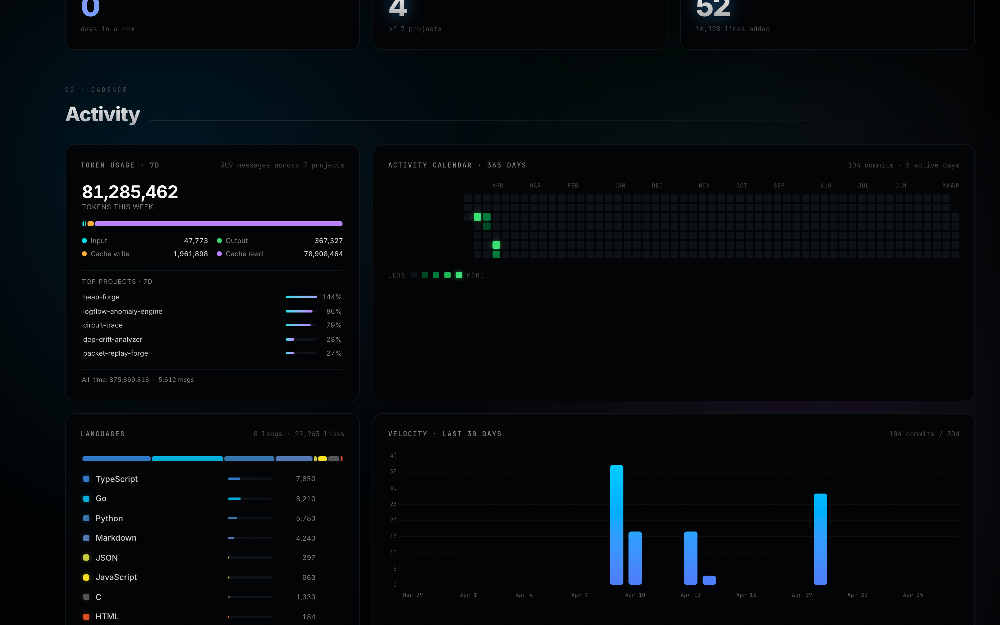
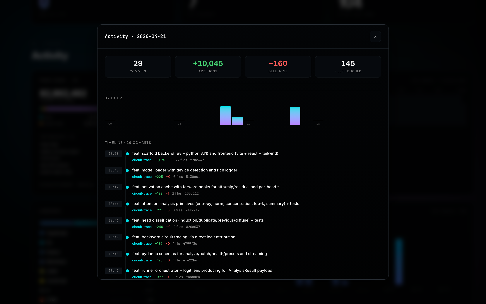
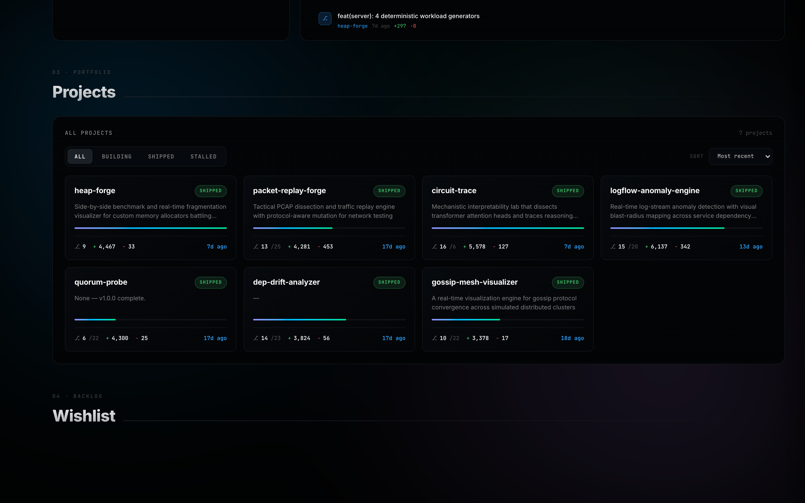
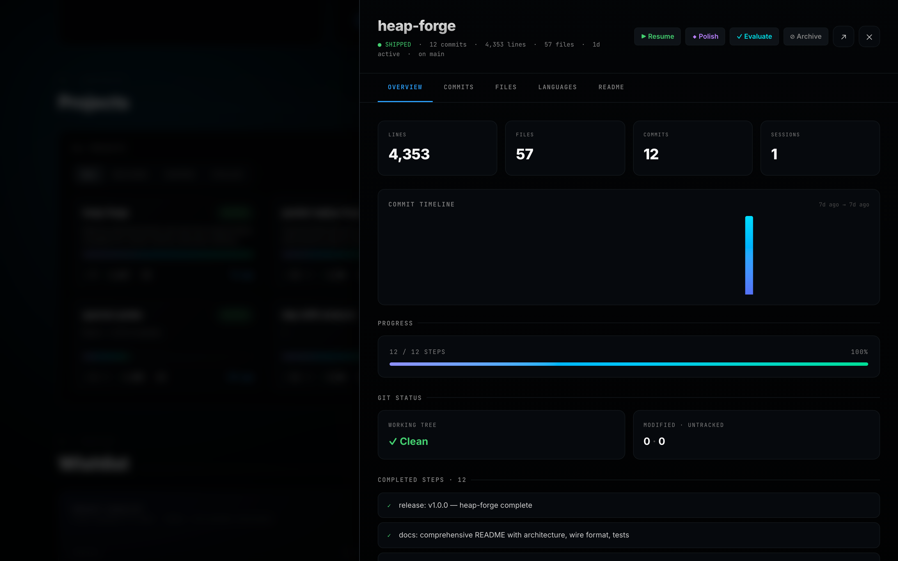
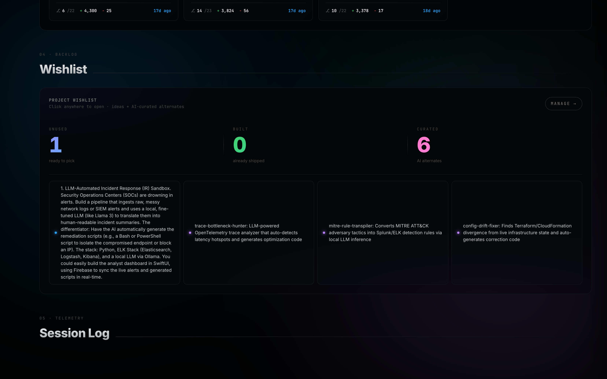
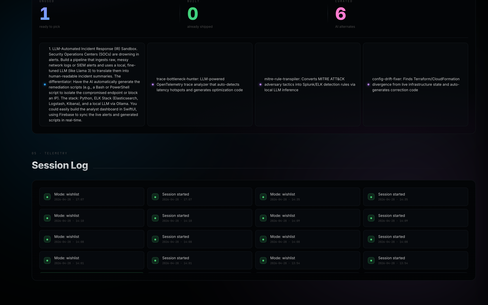

# daily-builder

> An autonomous portfolio builder that turns idle compute into shipped GitHub projects.

Every session, `start.sh` picks a domain, generates a fresh project idea, dedupes it
against history, hands the spec to Claude Code, builds the thing, evaluates the result,
and updates a live mission-control dashboard. You wake up to another repo on your profile.



---

## Why this exists

The mini-projects are a side-effect. The real product is the **builder itself** — the
domain rotation, the dedupe pass, the wishlist with AI-curated alternates, the
git-derived authoritative status, the token telemetry, the live dashboard, the
finishing-pass workflow.

A few of the things it has shipped so far:

| Project | Domain | Stack |
|---------|--------|-------|
| `circuit-trace` | AI/ML interpretability | Python, PyTorch, Three.js, FastAPI |
| `heap-forge` | Systems / low-level | C11, Go (cgo), TypeScript, React |
| `gossip-mesh-visualizer` | Distributed systems | Go, WebSocket, D3.js, SWIM |
| `packet-replay-forge` | Networking | Python, Scapy, FastAPI, React |
| `logflow-anomaly-engine` | Data engineering | Python, DuckDB, sklearn, React |
| `dep-drift-analyzer` | Devtools | Python, FastAPI, React |
| `quorum-probe` | Distributed systems | Go, Raft |

All built end-to-end by the same orchestration loop documented below.

---

## The full workflow

### 1 · One command, zero ceremony

```bash
bash ~/daily-builder/start.sh
```

The dashboard boots in the background at `http://localhost:8765` and the launcher
checks for an unfinished project (via git activity, never `state.md` — `state.md`
lies). If something's resumable, you get a one-key prompt:

```
  ◉ Unfinished project detected:

    heap-forge

  Status:   IN PROGRESS (working tree clean)
  Progress: 12 / 12 steps · 100%
  Last:     5b1c2af release: v1.0.0 — heap-forge complete

  Resume this project? (y/n):
```

If you say no — or there's nothing to resume — you get a mode prompt.

### 2 · Pick a mode

```
  Pick a mode:
    s — surprise   LRU domain + auto-generate idea
    g — guided     pick domain + give angle
    w — wishlist   pick from wishlist.md
```

| Mode | What it does |
|---|---|
| **surprise** | Picks the least-recently-used domain (weighted by `config.json`), generates an idea inside it, dedupes against history. |
| **guided** | You choose the domain (1–6) and write a one-line angle. The angle gets injected into the idea prompt. |
| **wishlist** | Pulls from `wishlist.md` + an AI-generated alternate list. *(Documented in section 3 below.)* |

After idea generation, every mode runs a **TF-IDF cosine similarity check** against
`project_history.md`. Above the configured threshold? It regenerates with an
explicit "this was too similar to X — go in a totally different direction"
correction. Up to 3 attempts.

### 3 · Wishlist mode — pick, add, or curate

The wishlist is your idea backlog. The launcher always offers three things at once:

- Numbered entries from your `## Unused` list
- AI-generated curated alternates (silently regenerated when the wishlist changes)
- An `a` shortcut to **add a new idea right then and there**, even when the list isn't empty

```
  Your wishlist:
    1 — LLM-Automated Incident Response Sandbox. Ingests raw SOC alerts and...
    2 — gossip-cluster-paint: real-time SWIM convergence visualizer

  Curated suggestions (LLM-generated alternates):
    3 — trace-bottleneck-hunter: LLM-powered OpenTelemetry analyzer
    4 — inline-rule-transpiler: convert MITRE ATT&CK rules into Splunk/ELK
    5 — config-drift-fixer: Terraform/CloudFormation divergence detector
    6 — gossip-cluster-paint: SWIM membership convergence visualizer

  Actions:
    a — add a new idea to your wishlist
    s — switch to surprise mode instead
    q — quit

  Pick a number, or a/s/q:
```

Picking a numbered item → that idea becomes the build target. Your own entries get
moved to the `## Used` section so they don't get picked twice. Curated suggestions
stay in `curated.md` and regenerate next time you change the wishlist.

The dashboard exposes the same workflow in a panel — same ideas, same counts, same
add affordance:



### 4 · What happens when a project is built

When you exit the Claude session at the end of a build, the launcher does the
following automatically:

1. **Evaluator runs** — 8 heuristic checks (README quality, git activity, tests,
   stub detection, secret scan, runnability, `state.md` health, plan progress)
   plus an optional LLM qualitative pass. Score gets written to
   `evaluation.json` inside the project, and appended to `project_history.md`.
2. **Status flips** — git mtime + final commit subject pattern (`release:`,
   `complete`, `v1.0.0`) flip the dashboard chip from **Building** to **Shipped**.
3. **Wishlist housekeeping** — if you started from a wishlist item, it was already
   moved to `## Used` at session start so it can't be picked again. Curated
   alternates regenerate on the next wishlist change.
4. **Dashboard updates live** — SSE pushes the new state to all connected
   browsers; the calendar gets the day's commits, the velocity graph picks up
   the new bars, the Shipped count ticks up.
5. **Finishing-pass suggestion** — if the score is below the configured
   threshold (default 75), the launcher prints
   `Suggest: start.sh --polish <repo>` so you know to schedule a cleanup session.

Nothing about "shipped" lives in `state.md`. Status is always derived from the git
working tree, the commit log, and the eval score — three sources you can't fake.

---

## The dashboard

Five sections, all clickable, all live-updating over Server-Sent Events.

### Overview · live mission status

Shows what's currently building (or "no project running"), the streak counter, the
shipped count, and total commits. Each card opens to a detail view.


Click the **Shipped** stat → modal listing every project that reached COMPLETE,
with eval scores and direct GitHub links:



### Activity · cadence + token burn

Token usage tile (Max plan input/output/cache breakdown by week, top projects),
365-day commit calendar, language distribution donut, 30-day velocity bars, hour×day
heatmap, recent commits feed.



Click any green calendar day → the day's commits drill-down with hour bars and
per-project stats:



### Projects · the portfolio

All projects with authoritative status (Building / Shipped / **Stalled** based on
`days_since_last_commit`), eval-score chip, line counts, commits, and time-since-
last-activity. Filter by status, sort by recency / commits / lines / name.



Click a project card → drawer with five tabs (Overview, Commits, Files, Languages,
README) and four actions:

| Action | What it does |
|---|---|
| ▶ **Resume** | Spawns `Terminal.app` running `start.sh --resume <repo>`. |
| ◆ **Polish** | Spawns Terminal running the dedicated finishing-pass session. |
| ✓ **Evaluate** | Runs the evaluator in-place; the card re-renders with the new score. |
| ⊘ **Archive** | Confirms, then moves the repo to `_archive/`. |



### Wishlist · the backlog

Same data the launcher uses — Unused, Built, AI-Curated counts, with quick previews.
Click anywhere to open the side panel and add/manage ideas.



### Log · session telemetry

Append-only feed of every `start.sh` session — mode, project name, timestamp.



---

## Install

```bash
git clone https://github.com/rayancheca/daily-builder ~/daily-builder
cd ~/daily-builder

# Python venv (only needed for pytest; main scripts are stdlib only)
python3 -m venv venv
venv/bin/pip install pytest

# Verify
venv/bin/python -m pytest tests/ -q
```

Requires:

- macOS or Linux with `bash`, Python 3.11+, `git`
- [Claude Code CLI](https://claude.com/claude-code) authenticated
- [GitHub CLI](https://cli.github.com) for repo creation
- Optional: `osascript` (macOS) for the dashboard's Resume-in-Terminal buttons

---

## Other launcher modes

```bash
bash start.sh --polish <repo>     # dedicated finishing-pass session
bash start.sh --evaluate <repo>   # just score it
bash start.sh --resume <repo>     # resume a specific project
bash start.sh --mode guided       # skip the mode prompt
```

---

## Architecture

```
~/daily-builder/
├── start.sh                    # the only script you run
├── config.json                 # all thresholds: stalled days, dedupe cutoff, etc.
├── wishlist.md                 # your idea backlog (Unused / Used)
├── curated.md                  # auto-generated AI alternates
├── project_history.md          # append-only log + eval scores
├── lib/
│   ├── paths.py                # typed Config loader
│   ├── project_state.py        # git-derived authoritative status
│   ├── pick_domain.py          # LRU + weighted domain picker
│   ├── dedupe.py               # stdlib TF-IDF similarity
│   ├── wishlist.py             # parser + add/mark_built + curated regen
│   ├── telemetry.py            # Claude Code transcript parser
│   └── evaluate.py             # heuristic + LLM evaluator
├── prompts/
│   ├── generate_idea.md        # domain-aware idea prompt
│   ├── evaluate.md             # LLM evaluation rubric
│   ├── finishing_pass.md       # polish-only session brief
│   ├── new_project.md          # full build spec
│   ├── dashboard_polish.md     # separate-session dashboard audit brief
│   └── rules/                  # modular agent rules
├── dashboard/
│   ├── server.py               # Python stdlib HTTP server + SSE
│   ├── index.html
│   ├── app.js                  # Chart.js + vanilla JS
│   └── style.css               # OKLCH tokens, no framework
├── docs/
│   └── screenshots/            # README assets (regenerated via Playwright)
├── portfolio-finish/           # workflow for finishing/shipping existing repos
└── tests/                      # pytest, all stdlib targets
```

### Data sources — single source of truth

| Question | Source |
|---|---|
| Is a project shipped? | git commit history + `state.md` cross-check |
| How much progress? | git feat/fix commit count vs. numbered plan in `CLAUDE.md` |
| Is a project stalled? | `days_since_last_commit >= stalled_days` (config) |
| Token usage? | `~/.claude/projects/**/*.jsonl` message-usage fields |
| Evaluation score? | 8 heuristic checks + LLM qualitative pass |
| Idea too similar? | TF-IDF cosine against `project_history.md` entries |

`state.md` is trusted for *display labels only*, never for counts or gating.

---

## Configuration

All knobs in `config.json`:

```json
{
  "abandonment": { "stalled_days": 3, "dead_days": 14 },
  "dedupe":      { "similarity_threshold": 0.55, "max_regens": 3 },
  "evaluator":   { "score_threshold": 75, "use_llm": true },
  "domain": {
    "weights": {
      "cybersecurity": 1.0, "systems": 1.0, "data": 1.0,
      "ai_ml": 1.0, "networking": 1.0, "devtools": 1.0
    }
  },
  "telemetry": {
    "transcripts_dir": "~/.claude/projects",
    "max_weekly_tokens": 10000000000,
    "max_session_tokens": 1000000000
  },
  "finishing_pass": { "auto_suggest_below_score": 75 }
}
```

Set a domain weight to `0` to exclude it. Raise another to bias toward it.

---

## Running the dashboard remotely

The dashboard is a local-only HTTP server that reads `~/dev/daily-projects/` and
`~/.claude/projects/` directly off your filesystem. It **cannot be deployed to
Vercel, Netlify, or any serverless platform** without a full rewrite.

To access it from another device, use a secure tunnel — the dashboard keeps running
on your desktop, the tunnel exposes it over a temporary public URL.

### Cloudflare Tunnel (recommended — free, persistent)

```bash
brew install cloudflared
cloudflared tunnel --url http://localhost:8765
```

Prints a `https://something-random.trycloudflare.com` URL. Works anywhere,
TLS-terminated by Cloudflare. Kill with Ctrl+C.

### ngrok (quick one-off)

```bash
brew install ngrok
ngrok http 8765
```

### Tailscale (cleanest for personal use)

```bash
brew install --cask tailscale
# Install on every device, then:
# http://<your-mac-name>:8765
```

No tunnel latency, no random URLs, devices reach each other over a private mesh.

---

## Testing

```bash
venv/bin/python -m pytest tests/ -v
```

27 tests across 5 modules — `project_state`, `pick_domain`, `dedupe`, `evaluate`,
`telemetry`. All stdlib-only assertions, no mocks beyond tmp git repos and
synthetic transcripts.

---

## Regenerating the screenshots

The README is documented as a workflow demo, so the screenshots are part of the
repo. Regenerate them whenever the dashboard changes:

```bash
# 1. Boot the dashboard
python3 ~/daily-builder/dashboard/server.py &

# 2. Run the capture script (uses Playwright)
cd /tmp && npm i playwright
node ~/daily-builder/scripts/capture-screenshots.mjs
```

Outputs land in `docs/screenshots/`.

---

## License

MIT.
